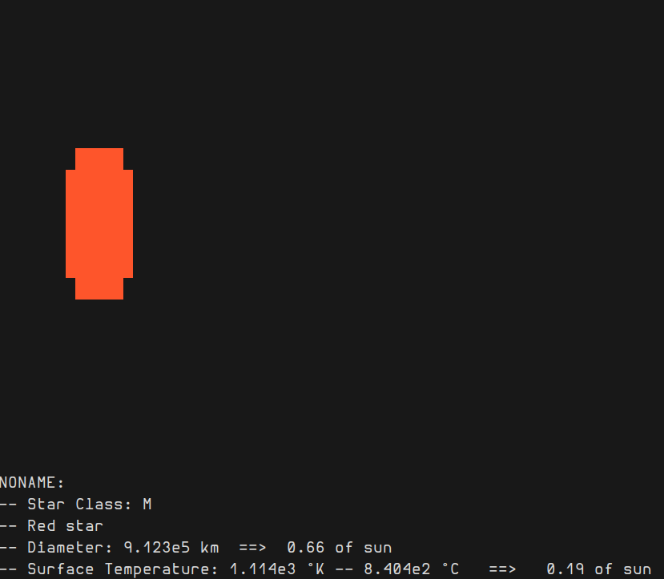

# Scifi Terminal Generator

Generate celestial bodies in the terminal.

## Usage

scifi_generator \[OPTIONS\] --body \<body-type\>

OPTIONS:
    -b, --body \<body-type\>      Type of the celestial body to generate [possible values: star, s, planet, p, satellite, sat]
    -n, --name \<name\>
    -t, --type \<planet-type\>    Type of planet to generate [possible values: terrestrial, t, gasgiant, gg, icegiant, ig]
    -c, --class \<star-class\>    Harvard Spectral classification of the star to generate [possible values: O, B, A, F, G, K, M]

## Example

`scifi_generator --body star --class K` produces the following:

## Dependencies

- Rust
- Rust's `std` lib
- `rand` v: 0.8.5
- `structopt` v: 0.3
